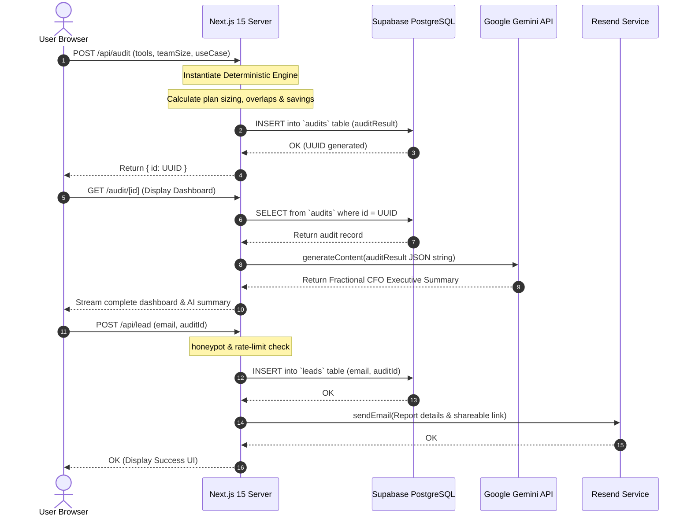

# SpendLens Architecture

SpendLens is a B2B micro-SaaS that helps founders, indie hackers, and agency owners optimize their AI tool stack and reduce monthly burn. 

The application is designed to be **fast, secure, and highly deterministic**. Instead of relying purely on LLMs to guess pricing, it uses a hardcoded deterministic engine to calculate exact financial overlaps, and then leverages Google Gemini strictly for qualitative executive summaries.

---

## 🛠 Tech Stack Overview

* **Framework:** Next.js 15+ (App Router)
* **Language:** TypeScript
* **Styling & UI:** Tailwind CSS v4 + Framer Motion
* **Database & Auth:** Supabase (PostgreSQL)
* **AI Integration:** Google Gemini 2.5 Flash (`@google/genai` SDK)
* **Transactional Emails:** Resend
* **Testing:** Vitest
* **Deployment:** Vercel

---

## 📊 Core System Flow

This sequence diagram illustrates the lifecycle of a SpendLens audit, starting from an anonymous user submission to lead capture, serverless database mutations, and streamed AI processing.



---

## 🏛 Core Architectural Components

### 1. The Client-Side Form (`SpendForm.tsx`)
* A multi-step React wizard built using Radix UI primitives and Framer Motion for premium micro-animations.
* State is persisted to `localStorage` client-side, ensuring users do not lose their inputs if they refresh the page or accidentally navigate away.

### 2. The API Route (`/api/audit/route.ts`)
* Receives the user payload, validates inputs against strict TypeScript interfaces (`src/types/index.ts`), and runs it through the core evaluation engine.
* Results are securely written to the Supabase database. The browser is never allowed to write directly to the database to prevent database injections.

### 3. The Deterministic Evaluation Engine (`audit-engine.ts`)
LLMs are notoriously poor at structured arithmetic and prone to pricing hallucinations. Because SpendLens handles B2B financial recommendations, we built a **deterministic evaluation engine** in plain TypeScript.
The engine executes four distinct financial checks:
1. **Plan Right-Sizing:** Checks if the user is paying for an Enterprise plan but has a team size small enough to downgrade to a Pro/Team plan.
2. **Cheaper Alternatives:** Analyzes feature overlaps (e.g. Cursor vs. Copilot) and recommends the cheaper alternative based on the user's specific use-case.
3. **API Arbitrage:** Detects if the user is overpaying for retail seats and recommends switching to raw APIs or enabling optimizations (like batch APIs or caching) if spend is high.
4. **Platform Discounts:** Recommends platform-level credits (e.g. Credex) to slash remaining costs by a flat percentage.

*The engine is fully unit-tested using Vitest to guarantee 100% financial accuracy.*

### 4. The AI Integration (Google Gemini)
* Once the user views their secure audit URL (`/audit/[id]`), the `AISummary.tsx` Server Component dynamically triggers the **Google Gemini 2.5 Flash** model.
* We pass the exact deterministic financial output as a JSON string to Gemini.
* Gemini is prompted to act as a "Fractional CFO" and write a personalized, 3-sentence executive summary explaining *why* the user should make the recommended switches.
* **Why Gemini 2.5 Flash?** We chose Flash because it offers sub-second latency, meaning the personalized summary streams into the UI almost instantaneously without blocking the page load.

### 5. Security & Lead Protection
* **Row Level Security (RLS):** Enabled on all Supabase tables. The browser client cannot read or write to the database directly. All database mutations happen securely within Next.js API Routes using the `SUPABASE_SERVICE_ROLE_KEY`.
* **Bot Mitigation:** Simple in-memory rate limiting restricts API calls to 5 per minute per IP address, protecting our Resend quota and Database limits from DDoS attacks.
* **No PII:** We deliberately do not ask for Company Names, Bank Accounts, or Plaid integrations. The audit is completely anonymous until the user willingly provides their email at the very end of the flow.

---

## 🚀 Scaling to 10k+ Audits / Month

To handle an influx of 10,000+ parallel monthly audits without degrading response times or increasing cloud database costs, the architecture will scale using the following enhancements:

### 1. Database Tier & Connection Pooling
With high parallel traffic, serverless Next.js functions can quickly exhaust PostgreSQL's maximum connection limits.
* **Optimization:** Implement **Supabase connection pooling** (using PgBouncer or Supavisor). This multiplexes thousands of transient serverless client connections into a small, steady pool of database connections, preventing connection-exhaustion timeouts (`504 Gateway Timeout`).
* **Indexing:** Create database indexes on `audits(id)` (UUID primary key) and `leads(email, audit_id)`. This keeps search queries at $O(1)$ complexity, ensuring sub-millisecond retrieval times as the tables grow to hundreds of thousands of records.

### 2. Edge-Caching Immutable Audits
Once a SpendLens audit is generated, its financial calculations are immutable. There is no reason to re-query the PostgreSQL database or trigger a new Gemini API call every time a user refreshes their dashboard.
* **Optimization:** Configure Next.js Route Handlers to serve `/audit/[id]` with `Cache-Control` headers:
  ```http
  Cache-Control: public, max-age=31536000, s-maxage=604800, stale-while-revalidate=86400
  ```
* This caches the completed HTML page across Vercel’s global Edge network. Subsequent visits will load instantaneously from the nearest edge CDN, reducing read traffic to Supabase and API token fees from Google Gemini to exactly **zero** for cached audits.

### 3. Queueing Transactional Emails (Asynchronous Processing)
Synchronously calling external APIs (like Resend) inside serverless functions increases latency and exposes the user request to potential external network failures.
* **Optimization:** Decouple email dispatching from the HTTP request-response cycle. When a user submits their email, `/api/lead` will write the lead record to Supabase and immediately push a message to an asynchronous queue (such as **BullMQ** backed by an Upstash Redis instance, or a serverless queue like **Upstash QStash**). 
* A background serverless worker processes the queue and dispatches emails asynchronously. If Resend experiences a temporary outage, the queue will retry automatically without throwing a user-facing error.

### 4. Distributed Rate Limiting
Our current rate-limiting is in-memory, which is isolated to individual serverless containers and resets during cold starts. This makes it vulnerable to distributed scrapers.
* **Optimization:** Move to a distributed rate-limiting model using **Upstash Redis** and the `@upstash/ratelimit` SDK. This allows all Next.js serverless functions globally to share a centralized, high-speed rate-limit counter in Redis (sliding-window log), guaranteeing absolute protection against malicious traffic spikes and securing our Resend and Gemini API quotas.
