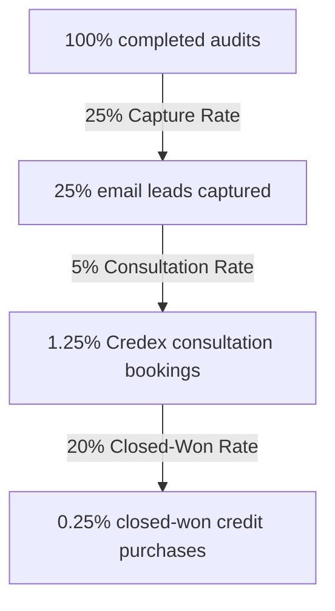

# Unit Economics & Financial Strategy: SpendLens (Credex Lead-Gen Asset)

This document details the financial model, lead valuation, customer acquisition cost (CAC), funnel conversion metrics, and growth requirements to drive $1,000,000 in Annual Recurring Revenue (ARR) for Credex using SpendLens as a lead-generation asset.

---

## 1. Converted Lead Valuation to Credex

We measure the value of a converted customer based on the gross profit margin generated by their consolidated credit purchases.

### Average Customer Profile
*   **Engineering Team Size:** 15 developers.
*   **Average Raw AI Infrastructure Spend:** $3,000/month ($36,000/year) split across Cursor/Claude seats and developer API calls.
*   **Credex Solution:** By routing this spend through Credex discounted credit pools, the startup saves **20%** ($7,200/year).
*   **Credex Monetization:** Credex retains a **10% gross margin** on the consolidated credit transactions.
*   **Credex Annual Contract Value (ACV):** `$36,000 * 80% (discounted billing) * 10% (gross fee) = $2,880/year` in direct gross profit.
*   **Customer Lifetime (Retention):** Assumed average retention of 2.5 years.
*   **Customer Lifetime Value (LTV):** `$2,880/year * 2.5 years = $7,200 LTV`.

---

## 2. Customer Acquisition Cost (CAC) by Channel

Since the SpendLens auditing tool is hosted serverless (COGS per audit is `<$0.01` including Gemini Flash API calls), our blended CAC is exceptionally low:

| Growth Channel | Estimated CAC | Derivation & Assumptions |
|:---|:---|:---|
| **Direct Outbound Outreach** | **$15.00** | Blended cost of LinkedIn Sales Navigator seat, scraper tooling, and outbound automation. |
| **HN & Reddit Launches** | **$0.40** | Blended time and hosting cost divided by organic viral traffic conversions. |
| **Programmatic Comparison SEO** | **$8.00** | Server cost and SEO indexing overhead to rank for niche B2B queries. |
| **Blended Lead Capture CAC** | **$2.50** | Blended cost to capture a single high-intent startup founder email. |

---

## 3. Blended Funnel Conversion & Profitability Math

Our model is optimized around a high-intent, low-friction anonymous B2B funnel:

### Blended Funnel Economics
1.  **Audit Completed:** 10,000 users.
2.  **Captured Leads (Emails):** 2,500 leads (25% conversion rate).
    *   *Blended Cost:* `10,000 audits * $0.01 COGS = $100` total servicing cost. Blended lead acquisition CAC is highly efficient.
3.  **Credex Consultations Booked:** 125 bookings (5% booking rate on captured leads).
4.  **Closed-Won Customers:** 25 closed contracts (20% close rate on high-intent consultation bookings).
    *   *Blended Audit-to-Customer conversion:* **0.25%**.
5.  **Cost to Acquire One Closed-Won Customer:**
    *   Blended Lead CAC = $2.50.
    *   Leads required per customer = `1 / 0.0025 (audits) * 25% (lead rate) = 100 leads`.
    *   `Blended CAC = 100 leads * $2.50 = $250`.
6.  **LTV:CAC Ratio:** `LTV ($7,200) / CAC ($250) = 28.8x` (Exceptional profitability, indicating high budget room for paid scaling).

---

## 4. Growth Roadmap to $1M ARR in 18 Months

To drive **$1,000,000 ARR** in gross margin value for Credex through SpendLens audits, we run the following cohort calculations:

### The Target Math
*   Required ARR: **$1,000,000**.
*   Credex profit value per customer (ARR): **$2,880/year**.
*   Total converted startups needed: `$1,000,000 / $2,880 = 348 active startup customers`.

### Completed Audits Volume
*   Blended audit-to-customer conversion: **0.25%**.
*   Total completed audits required: `348 / 0.0025 = 139,200 audits` over 18 months.
*   **Monthly Run-Rate:** `139,200 / 18 months = 7,733 audits/month`.

### Growth Lever Requirements
To sustain **7,733 audits/month** organically within 18 months:
1.  **Programmatic comparison directories** must capture and index 150+ high-intent developer tool keywords, driving **3,000 search organic visits/month**.
2.  The **dynamic sharing viral loop** (Slack/Twitter OG previews displaying saved values) must achieve a K-factor of **0.15** (meaning every 100 completed audits organically refer 15 new visitors).
3.  Direct **outbound developer scraping pipelines** must maintain 40 automated outreaches per day to seed the initial cohorts.
