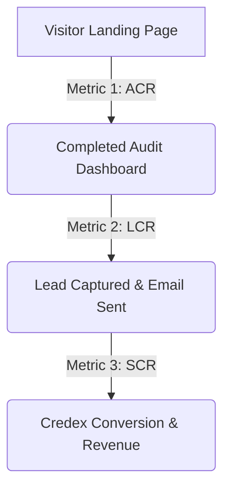

# SpendLens — Metrics Framework

To measure the health, adoption, and financial viability of SpendLens as a high-intent lead generation engine, we have established a robust metrics framework. This framework is split into a primary North Star metric and three supporting input metrics.

---

## 🌟 The North Star Metric
### **Annualized AI Spend Savings Identified & Captured (USD)**

* **Definition:** The total, annualized dollar amount of AI tool subscriptions saved by our users that is directly captured or migrated through Credex credits conversion.
* **Why this is our North Star:** 
  It perfectly aligns the value delivered to the user with the business value captured by Credex. If we identify massive savings but users don't act on them (i.e. we don't capture the conversion), we aren't delivering real utility. Conversely, if we capture conversions but they don't actually save the user money, the product fails long-term. This metric ensures we optimize for highly accurate, high-margin, and actionable financial audits.
* **Formula:**  
  $$\text{North Star} = \sum (\text{Annual Savings of Audit } i \times \text{Credex Credit Conversion CTR } i)$$

---

## 📈 The Three Input Metrics

To drive our North Star metric, we monitor and optimize three key operational input metrics across the user funnel.

### 1. **Audit Completion Rate (ACR)**
* **Category:** Activation & UX Efficiency
* **Definition:** The percentage of landing page visitors who successfully progress through all 3 steps of the `SpendForm` and view their secure results page.
* **Why it matters:** It is our primary indicator of onboarding friction. If the wizard is too complicated, or if users get confused by the seat input fields, ACR drops.
* **Target:** **> 65%** (industry benchmark for anonymous multi-step calculators is 40%).
* **How we optimize it:**
  * Client-side validation to prevent form submission errors.
  * Instant, beautiful progress bars and micro-animations to reduce perceived cognitive load.
  * Preserving state using `localStorage` so users never lose entered data if they refresh.

### 2. **Lead Capture Conversion Rate (LCR)**
* **Category:** Lead Generation & Value Perception
* **Definition:** The percentage of users who complete an audit and willingly submit their email address on the results page to receive their PDF report and secure access link.
* **Why it matters:** This is our core business outcome. SpendLens operates as a B2B lead generation engine. A high LCR proves that our audit results were valuable enough that the user wanted to save and share them.
* **Target:** **> 30%** (average lead magnet conversion is 10-15%).
* **How we optimize it:**
  * Delaying the email capture until the user has *already* seen their total annualized savings, generating high-intent reciprocity.
  * Making the transactional email incredibly rich, containing a clean summary table and their unique shareable link.
  * Preventing bot spam via a hidden "honeypot" field and in-memory rate limiting to ensure lead quality is pristine.

### 3. **Platform Savings Capture Rate (SCR) / Credex CTR**
* **Category:** Monetization & Referral Velocity
* **Definition:** The click-through rate (CTR) on the primary recommended partner action (e.g. "Switch to GitHub Copilot via Credex" or "Save 20% on ChatGPT via Credex credits") displayed on the results dashboard.
* **Why it matters:** This directly drives the revenue funnel. Credex monetizes by selling discounted AI infrastructure credits. SCR measures the percentage of audited savings that we successfully convert into active Credex customers.
* **Target:** **> 8%** of all audited leads.
* **How we optimize it:**
  * Displaying a prominent, premium call-to-action (CTA) button on the results page alongside the exact savings amount.
  * Integrating Google Gemini to write highly personalized, persuasive CFO paragraphs explaining the exact financial benefits of switching to Credex credits.
  * Displaying the Credex discount badge next to retail subscription options to create instant cost contrast.

---

## 🛠 Tracking & Analytics Implementation

To maintain strict GDPR and privacy compliance, we track these metrics anonymously:
1. **Database Counters:** We count row insertions in the `audits` table (ACR) and the `leads` table (LCR) via secure PostgreSQL count aggregates.
2. **Dynamic Segments:** We group audits by `savingsTier` ('high' | 'medium' | 'low' | 'optimal') to analyze which customer segments yield the highest lead conversion rates, allowing us to tailor our B2B marketing channels toward high-value leads.
