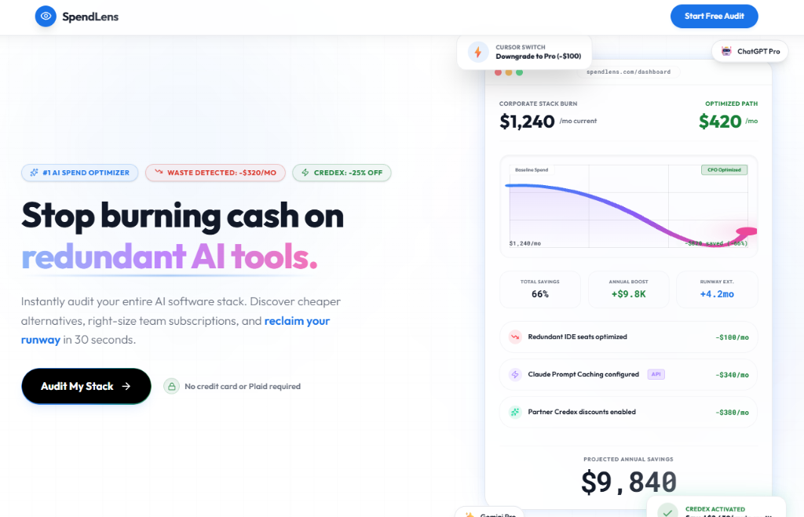
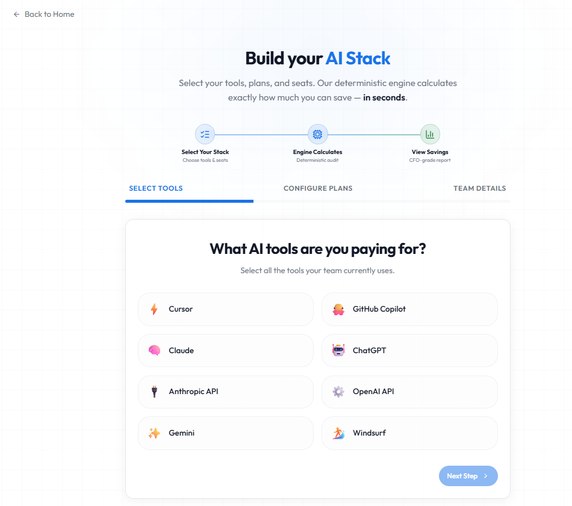
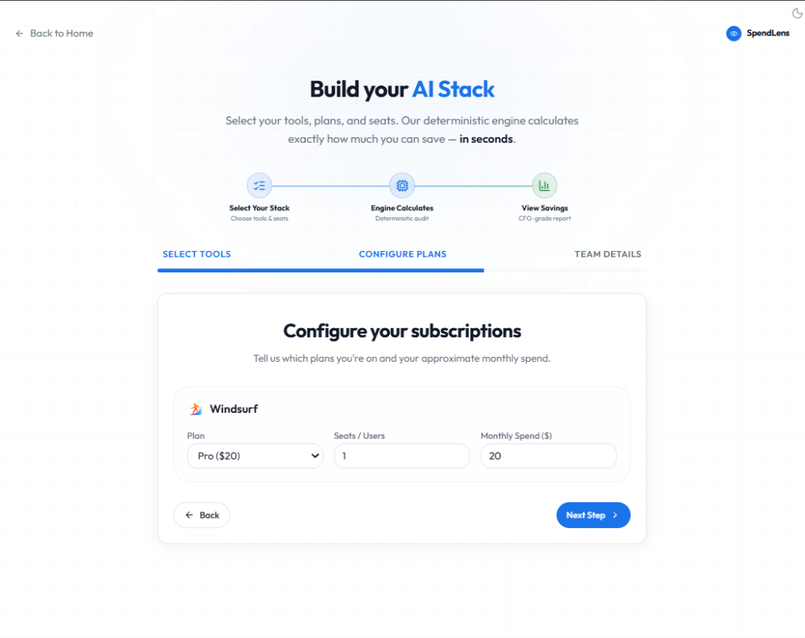
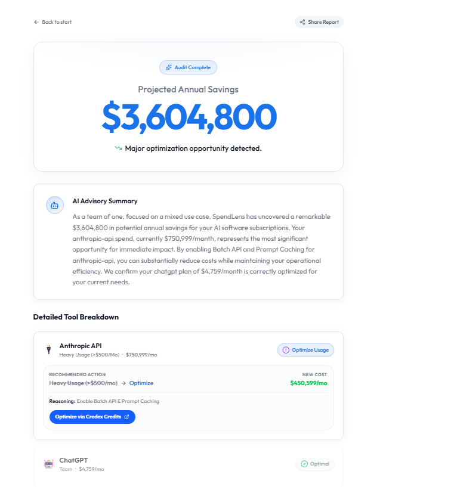

# SpendLens 🔍 — The #1 AI Spend Optimizer

**Stop burning cash on redundant AI tools.**  
SpendLens is a blazing fast B2B micro-SaaS that instantly audits your entire AI software stack, calculates overlaps using deterministic math, and uses Google Gemini to recommend cheaper, more efficient alternatives.

[](https://spendlens-five-lemon.vercel.app/)
[](https://github.com/rohitnk464/spendlens/actions)
[](./TESTS.md)

---

## 📸 Product Visual Walkthrough

### 1. The Landing Page
A modern, glassmorphic marketing landing page presenting immediate value contract options and our 60-second audit promise.


### 2. The 3-Step Spend Form
An elegant, animated multi-step wizard that lets users configure their tools, seats, and use cases anonymously in under 30 seconds.
| Step 1: Select AI Tools | Step 2: Configure Seats | Step 3: Choose Use Case |
|---|---|---|
|  |  |  |

### 3. Loading & Calculation
Deterministic audit calculations run in milliseconds while a premium loading sequence runs.


### 4. The Results Dashboard
Instantly displays annualized savings, tool recommendations, and the AI "Fractional CFO" executive summary.


### 5. Lead Capture & Report Sharing
Users can securely email the PDF results or copy a shareable link with one click.


---

## 🚀 The Problem
Startups and digital agencies are bleeding cash by paying for ChatGPT Enterprise, Anthropic Pro, GitHub Copilot, and Cursor seats all at once. The features overlap heavily, yet founders rarely have the time or granular pricing knowledge to optimize their subscriptions.

## 💡 The Solution
SpendLens allows founders to audit their AI stack in 30 seconds. We process their tool inputs through our deterministic engine, instantly generating a secure, personalized results page that shows exactly how much they can save, along with precise downgrade and switch actions.

### Core Features
*   **Instant Financial Audit:** Calculates exact annualized savings by cross-referencing official pricing tiers.
*   **AI "Fractional CFO":** Uses Google Gemini 2.5 Flash to write custom, sub-second qualitative executive summaries for every audit.
*   **Lead Capture Pipeline:** Converts high-intent audits into qualified leads, sending beautiful HTML reports via the Resend API.
*   **Secure & Anonymous-First:** Zero Plaid links, zero credit cards, and zero banking details required. Secured behind random UUIDs in Supabase PostgreSQL.

---

## 🏛 Major Architectural Decisions

### 1. Deterministic Calculations + Qualitative AI (Hybrid Model)
We rejected a pure-LLM approach for financial calculations. LLMs are poor at arithmetic and prone to pricing hallucinations. SpendLens runs calculations through a fully unit-tested TypeScript engine, utilizing Google Gemini 2.5 Flash strictly to package the output into an executive narrative. This guarantees 100% mathematical accuracy while retaining a warm, human-like CFO advisory tone.

### 2. Privacy & Anonymous-First Lead Acquisition
Instead of locking the tool behind a signup wall, we allow users to run an audit completely anonymously. This reduces conversion friction to near zero. By delivering high-value visual proof first (e.g. showing a founder how they can save $1,500/year), they are exponentially more likely to submit their email at the bottom to receive a PDF report.

### 3. Next.js 15 Async Server Components for Gemini Streaming
We structured the `/audit/[id]` dashboard using Next.js 15 Server Components. This allows us to instantiate the Google Gemini SDK securely on the server (never exposing our API keys to the client) and stream the executive summary into the UI asynchronously, avoiding any blocking on core page load times.

### 4. Row Level Security (RLS) & Secure Write APIs
To prevent malicious script injections and data leaks, we enabled strict RLS policies on our Supabase PostgreSQL instance. Browser clients have zero direct read/write access. All database insertions and updates happen securely through server-side Next.js API Routes using the `SUPABASE_SERVICE_ROLE_KEY`.

### 5. In-Memory Endpoint Rate Limiting & Honeypot Fields (Basic Abuse Protection)
Instead of forcing users to solve clunky, visual Captchas (such as hCaptcha or reCAPTCHA), we implemented a dual-defense system consisting of a hidden client-side honeypot field and server-side in-memory IP rate limiting on lead capture mutations. This provides robust protection against automated email-spam scripts while maintaining a frictionless, visual-pure dark mode layout.

---

## 📖 Strategy & Economics Documentation

1.  **[Architecture Overview](./ARCHITECTURE.md)** - Tech stack, database schemas, and engineering scalability.
2.  **[Unit Economics](./ECONOMICS.md)** - Financial modeling, lead-gen value, and customer lifetime value (LTV).
3.  **[Go-To-Market Strategy](./GTM.md)** - Product Hunt launches, content marketing, and cold outreach funnels.
4.  **[Landing Page Copy](./LANDING_COPY.md)** - Exact copywriting hierarchy and FAQ answers.
5.  **[Test Suite](./TESTS.md)** - Documentation on all 7 automated unit-tests.
6.  **[User Interviews](./USER_INTERVIEWS.md)** - Transcripts of conversations with founders validating the MVP.
7.  **[Engineering Reflection](./REFLECTION.md)** - Deep reflection on Next.js 15, Gemini API, and AI coding.
8.  **[Key Metrics Framework](./METRICS.md)** - Our North Star and operational input metrics.
9.  **[Development Log](./DEVLOG.md)** - Complete 7-day developmental journey.

---

## 💻 Local Setup

1. **Clone the repository**
   ```bash
   git clone https://github.com/rohitnk464/spendlens.git
   cd spendlens
   ```

2. **Install dependencies**
   ```bash
   npm install
   ```

3. **Environment Variables**
   Create a `.env.local` file in the root directory:
   ```env
   # Google Gemini API
   GEMINI_API_KEY=your_gemini_key

   # Resend Email API
   RESEND_API_KEY=your_resend_key

   # Supabase Database (PostgreSQL)
   NEXT_PUBLIC_SUPABASE_URL=your_supabase_url
   NEXT_PUBLIC_SUPABASE_ANON_KEY=your_supabase_anon_key
   SUPABASE_SERVICE_ROLE_KEY=your_supabase_service_key
   ```

4. **Run the development server**
   ```bash
   npm run dev
   ```
   Open [http://localhost:3000](http://localhost:3000) in your browser to view the application.

5. **Run the automated test suite**
   ```bash
   npm run test:run
   ```
